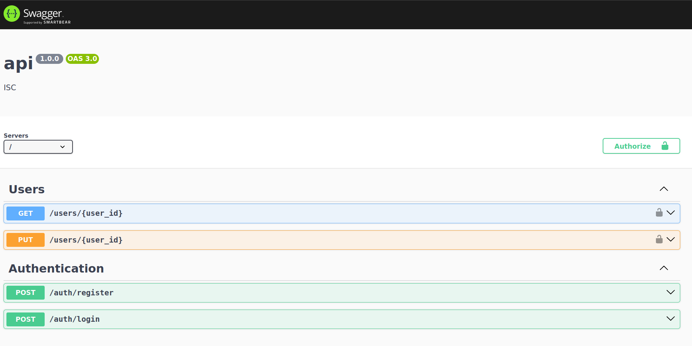
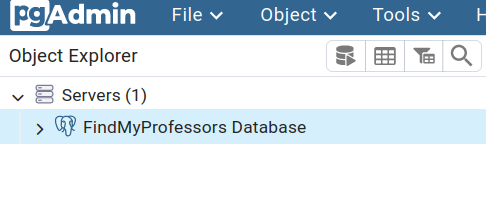
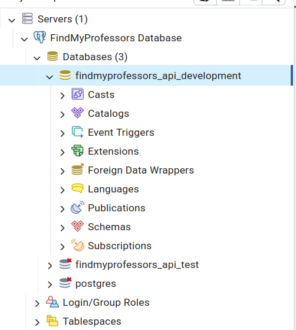

# FindMyProfessors

## Setup
To setup your FMP instance, you need to use docker compose to start the backend, database, frontend, and pgadmin.  
```bash
docker compose up --build
```

## Accessing the API Documentation (Swagger)
When the docker compose is running, you are able to access the API documentation at http://localhost:8080/docs.


## Accessing Database (pgadmin)
When the docker compose is running, you are able to access the database using pgadmin.

1. Open http://localhost:8888 in your browser, if you are using the dev container you will need to forward port 8888
2. Login with the following details
   ```
   Email: joemama@joemama.com
   Password: admin
   ```
3. Select the servers tab

   
4. Use the password `test` to access the FindMyProfessors Database
5. Use the `findmyprofessors_api_development` table for development
   
   

## FAQ

### Setting a user to admin

Either you can use pgadmin to update the user, or you can use the following command
```bash
./scripts/api/set_admin.sh <user_id>
```

### File permissions problems
Run the following command
```bash
ls -alh
```

```bash
sudo chown -R vscode:vscode * .*
```

```bash
ls -alh
```

Notice the difference?